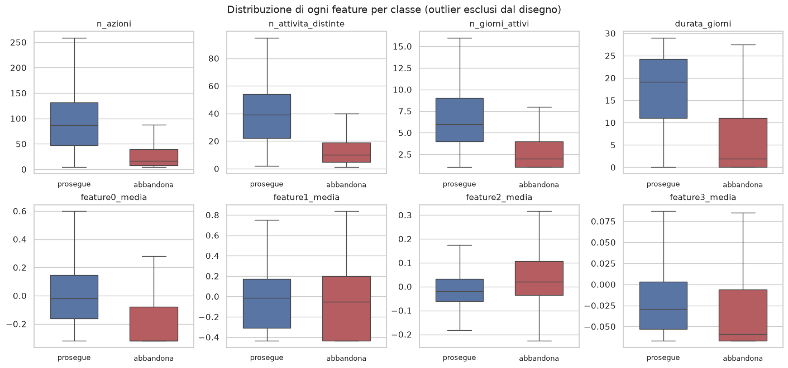
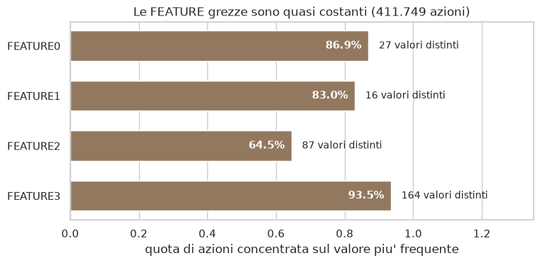
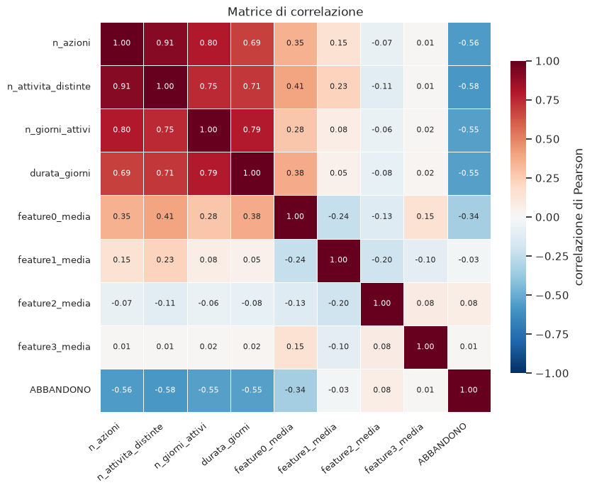
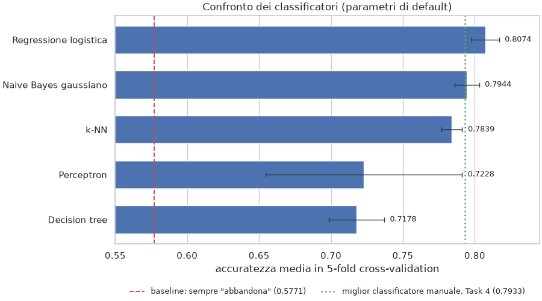
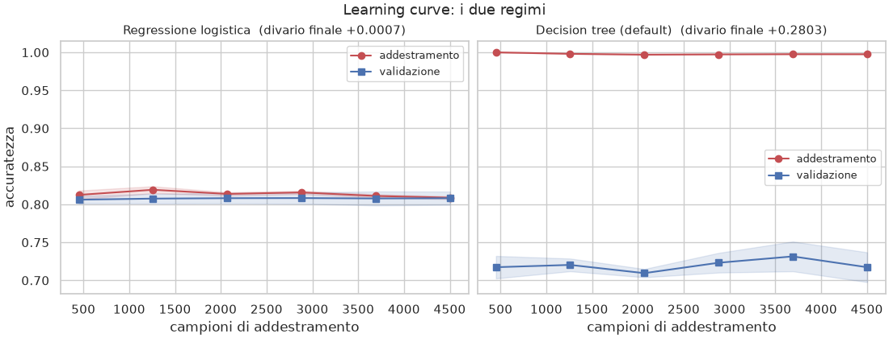
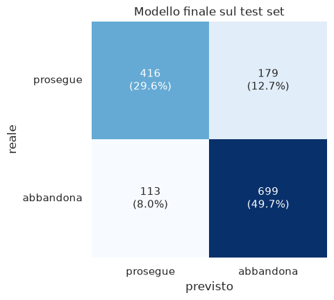

# Previsione dell'abbandono in una piattaforma MOOC

**Corso.** Fondamenti e Applicazioni del Machine Learning, A.A. 2026 — prof. Fabrizio Rossi,
prof. Fabio Persia.
**Studenti.** Federico Ciccarelli, Lorenzo Lallone.
**Dataset.** *act-mooc* (Stanford SNAP): 411.749 azioni di 7.047 studenti su 97 attività, in circa
30 giorni.
**Problema.** Classificazione binaria — prevedere l'abbandono dello studente.
**Modello finale.** Regressione logistica (`StandardScaler`, `C = 0,1`): **79,25%** di accuratezza
sul test set, F1 0,8272, ROC-AUC 0,8485. Baseline: 57,71%.

**Struttura della relazione.** Una sezione per task, nell'ordine in cui il lavoro è stato svolto.
Ogni sezione riporta le decisioni prese, la loro motivazione e la verifica numerica che le
sostiene. Le motivazioni estese di ciascun task, con le alternative scartate, stanno nei documenti
omonimi in `documentation/`; i numeri sono tutti riproducibili eseguendo i notebook in
`notebooks/`.

---

## Il filo conduttore

Il progetto racconta una sola storia. Tutto ciò che segue ne è una conferma, ottenuta per strade
indipendenti.

> Il dataset non è tabellare: è una **sequenza di eventi**. Il lavoro vero è stato cambiare l'unità
> di analisi — dall'azione allo studente — perché l'etichetta descrive lo studente, non l'azione.
> Quel passaggio ha dissolto uno sbilanciamento apparente e ha reso il problema trattabile. Da lì in
> poi **ogni modello si ferma intorno al 79%**, nostro o preso da Scikit-Learn, semplice o
> complesso: il limite non è nel modello, è in quanta informazione le feature contengono.

| | da | a | perché conta |
|---|---|---|---|
| unità di analisi | 411.749 azioni | **7.047 studenti** | l'etichetta marca l'ultima azione di chi abbandona: è una proprietà dello studente |
| prevalenza della classe positiva | 0,99% | **57,7%** | lo sbilanciamento estremo esisteva solo nell'unità di analisi sbagliata |
| accuratezza, dal manuale allo sklearn | 0,7734 | **0,7925** | il guadagno c'è, ed è piccolo |

I cinque task non sono una sequenza amministrativa: ognuno risponde a una domanda lasciata aperta
dal precedente, e due volte una nostra ipotesi è stata *smentita* dai dati e riportata lo stesso.

---

## Task 1 — Dal log di eventi alla tabella di studenti

*Notebook* `01_preprocessing.ipynb` — *motivazioni* `01_preprocessing.md`

Tre file TSV allineati per riga — azioni, feature, etichette — da cui ricavare una tabella su cui si
possa addestrare. Tre decisioni, tutte difendibili singolarmente.

### a. Unione per posizione, non con un `merge`

`ACTIONID` non è una chiave nel file delle etichette: **396.633** valori distinti su **411.749**
righe. Un `merge` perde 15.116 righe e ne duplica altre 15.116, restituendo **esattamente lo stesso
numero di righe**. È il tipo di errore che un controllo su `len()` non vede.

```python
dati = azioni.copy()
dati[COLONNE_FEATURE] = feature[COLONNE_FEATURE].to_numpy()   # affianca per posizione
dati["LABEL"] = etichette["LABEL"].to_numpy()
```

### b. Il cambio di unità di analisi

`LABEL = 1` marca l'**ultima azione** di chi abbandona. Non descrive quell'azione: descrive lo
studente. Aggregando per `USERID` si passa da 411.749 righe a 7.047, e la prevalenza sale da 0,99%
a 57,7%.

### c. Esclusione dell'ultima azione di *ogni* studente

Non solo di chi abbandona. Se la togliessimo ai soli positivi, la regola di costruzione delle
feature dipenderebbe dal target: sarebbe **leakage**.

```python
storia = dati.drop(index=dati.groupby("USERID").tail(1).index)

gruppi = storia.assign(GIORNO=storia["TIMESTAMP"] // 86400).groupby("USERID")
studenti = pd.concat([
    pd.DataFrame({
        "n_azioni":            gruppi.size(),
        "n_attivita_distinte": gruppi["TARGETID"].nunique(),
        "n_giorni_attivi":     gruppi["GIORNO"].nunique(),
        "durata_giorni":       (gruppi["TIMESTAMP"].max() - gruppi["TIMESTAMP"].min()) / 86400,
    }),
    gruppi[COLONNE_FEATURE].mean().rename(columns=lambda c: c.lower() + "_media"),
], axis=1)
```

Le 404.702 righe rimaste vengono scorse **una volta sola**, dentro pandas. Anche le quattro medie
escono da una singola aggregazione su tutte le colonne insieme, non da quattro giri di ciclo.

**I due file prodotti:** `manuale.csv` — 12 studenti, 6 positivi e 6 negativi, estratti con
`random_state=42` — e `training.csv` con i restanti 7.035.

---

## Task 2 — I due classificatori scritti a mano

*Notebook* `02.1_naive_bayes.ipynb`, `02.2_decision_tree.ipynb`

Gruppo di due componenti, due classificatori. Scelti perché **complementari**, e perché sono gli
unici del programma i cui calcoli si possono svolgere per intero su dodici righe — cioè
verificabili a mano.

| | decision tree | Naive Bayes |
|---|---|---|
| tipo | discriminativo | generativo |
| usa le feature | una alla volta | tutte insieme |
| produce | regole esplicite | probabilità |
| ipotesi forte | separabilità a soglie | indipendenza condizionale |

### Decision tree — ID3 con information gain

Feature continue, quindi soglie sui **punti medi** fra valori consecutivi: non discretizziamo, così
è l'information gain a scegliere il confine invece di sceglierlo noi.

```python
def entropia_binaria(positivi, totali):        # scritta sui CONTEGGI, non sulle etichette
    p = np.divide(positivi, totali, out=np.zeros_like(totali, float), where=totali > 0)
    q = 1 - p
    return -(np.where(p > 0, p * np.log2(p), 0) + np.where(q > 0, q * np.log2(q), 0)) + 0.0

def guadagno(a_sinistra, y):                   # a_sinistra: (campioni x split candidati)
    positivi, n = (y.to_numpy() == 1)[:, None], len(y)
    n_sx, pos_sx = a_sinistra.sum(axis=0), (a_sinistra & positivi).sum(axis=0)
    return (entropia(y) - (n_sx / n)       * entropia_binaria(pos_sx, n_sx)
                        - ((n - n_sx) / n) * entropia_binaria(positivi.sum() - pos_sx, n - n_sx))
```

Scritta così, `entropia_binaria` prende i *conteggi* e diventa un'espressione di soli operatori
aritmetici: la stessa riga vale per un nodo o per trecento split in parallelo. `a_sinistra` ha una
riga per campione e una colonna per split candidato, quindi tutte le coppie (feature, soglia) del
nodo si valutano in una passata.

**Risultato.** `n_attivita_distinte <= 22,5` ottiene **IG = 1,0000**, il massimo possibile: separa i
12 campioni senza errori. L'albero è **un solo nodo**. Accuratezza 1,0000 su `manuale.csv`,
**0,7734** su `training.csv`.

**Controprova.** Togliendo la feature dominante l'albero cresce su due livelli e resta 12/12 — ma
alla radice **cinque feature su sette pareggiano** con lo stesso information gain: quella che
finisce nell'albero è solo la prima nell'ordine delle colonne. Con 12 campioni non c'è nulla da
scegliere.

### Naive Bayes — discretizzato alla mediana, con correzione di Laplace

Qui invece discretizziamo, con una sola regola: ogni feature tagliata alla propria mediana. Il
motivo è sperimentale. Il Naive Bayes *gaussiano*, su questi dati, ha una varianza degenere —
`feature3_media` vale 0,000180 nella classe 1, con cinque valori su sei identici — che gli fa
dominare il prodotto con una densità di **26,91** contro 0,01–3,58 delle altre. Fuori campione
perde **7,6 punti**.

```python
P_sopra = (conteggio + 1) / (n_classe + 2)                 # correzione di Laplace
punteggio_k = np.log(priori[k]) + Σ np.log(P(x_i | k))     # somma di logaritmi
```

**Risultato.** 1,0000 su `manuale.csv`, **0,7790** su `training.csv`. Tre celle su sedici avevano
stima grezza 0 o 1: senza Laplace uno zero avrebbe azzerato un'intera classe.

**Il dettaglio che rende credibile il 100%.** Il margine `|log P(1) − log P(0)|` va da **0,105** a
**9,742**: un campione è classificato correttamente per un decimo di unità. Il 100% su dodici
campioni non è un risultato, è un'osservazione sul fatto che dodici campioni sono pochi.

---

## Task 3 — Data quality ed analisi esplorativa

*Notebook* `03_analisi_esplorativa.ipynb` — *motivazioni* `03_analisi_esplorativa.md`

Il risultato più importante di questo task è negativo: **il dataset non richiede pulizia**. La parte
interessante è capire perché tre feature su otto non contengono niente — e che la colpa non è
nostra.

Zero valori mancanti, `USERID` univoco, cinque vincoli logici su sei soddisfatti.

### Il sesto vincolo fallisce, e non è un errore

`n_giorni_attivi <= durata_giorni + 1` è falso in **392** righe, il 5,6%. La causa:
`n_giorni_attivi` conta i **giorni di calendario** (`TIMESTAMP // 86400`), quindi due azioni a
cavallo della mezzanotte cadono in bucket diversi pur distando pochi minuti. Verificato sui
timestamp grezzi dello studente 9.

### Nessuna riga va rimossa

Le **358** righe con profilo identico sono studenti *diversi* con storie brevissime — mediana 5
azioni contro 37: rimuoverle toglierebbe quasi solo abbandoni e distorcerebbe il target. I valori
estremi sono medie su decine di azioni reali, non refusi.



**Le quattro feature di quantità separano nettamente le classi** — numero di azioni, attività
distinte, giorni attivi, durata. Le `feature*_media` quasi per niente: le loro distribuzioni sono
sovrapposte.

### Il risultato che spiega tre cose in una volta

Le FEATURE del dataset **originale** sono standardizzate ma quasi costanti: `FEATURE3` ha lo stesso
valore nel **93,5%** delle azioni.



**Una sola causa spiega tre osservazioni fatte in task diversi:** le correlazioni a zero del Task 1,
la varianza degenere del Naive Bayes gaussiano del Task 2, e il terzo di studenti bloccati sul
valore minimo di `feature0_media`. Il difetto è del dataset originale, non del nostro preprocessing.



**Due blocchi.** Le quattro feature di quantità correlate al target fra −0,55 e −0,58, e **fra loro
fino a 0,91**; le altre tre fra −0,03 e +0,08. È da qui che nasce l'avvertenza sui coefficienti del
modello finale.

---

## Task 4 — Ottimizzazione dei classificatori manuali

*Notebook* `04_valutazione.ipynb` — *motivazioni* `04_valutazione.md`

Qui il protocollo è metà del contenuto: ricerca sul 70%, verifica sul 30% una volta sola,
cross-validation a 5 pieghe per il confronto finale. Serve soprattutto a produrre la **deviazione
standard**, **0,0095** — senza quella non si può dire se mezzo punto sia un miglioramento o rumore.

### Decision tree

La soglia si sposta da 22,5 a **28**. Crescendo in profondità si guadagnano meno di 0,8 punti, ma la
deviazione standard cresce di oltre il 60% (da 0,0086 a **0,0141**): è overfitting, misurato. E su
**29 nodi di decisione, 16 — il 55% — hanno entrambi i rami che portano alla stessa classe**:
riducono entropia senza cambiare alcuna predizione.

### Naive Bayes — il risultato più istruttivo del progetto

Il modello tarato su **12 campioni** batteva quelli con soglie stimate su migliaia di righe. Invece
di accettarlo, abbiamo formulato un'ipotesi — non conta la numerosità, conta il bilanciamento — e
l'abbiamo testata.

| soglie stimate da | accuratezza | confronto appaiato |
|---|---|---|
| `manuale.csv` — 12 campioni, **bilanciato** | **0,7902** | — |
| `training.csv` così com'è (57,7% positivi) | 0,7775 | perde **5 pieghe su 5** |
| `training.csv` **ribilanciato** | 0,7889 | pareggia (2/5) |

Il divario sparisce appena si ribilancia. La conclusione è generale: per una soglia di taglio **non
conta la numerosità del campione, conta che rappresenti equamente le due classi**.

*(0,7902 e non 0,7790 perché qui dai 12 campioni vengono solo le soglie: le probabilità condizionate
sono ristimate su ogni piega di addestramento.)*

**Esito complessivo del task:** da 0,7734 a **0,7933**, cioè +2,0 punti, circa due deviazioni
standard. È un miglioramento reale, e lo si può affermare solo perché la deviazione standard è stata
misurata.

---

## Task 5 — Scikit-Learn e la scelta del modello finale

*Notebook* `05_modellazione.ipynb` — *motivazioni* `05_modellazione.md`

Divisione 80/20 stratificata, con il test set **messo da parte subito** e non toccato fino alla
scelta finale. Ogni decisione — modelli, scaler, feature, iperparametri, soglia — è presa in
cross-validation sul solo training set.

In gara i **cinque modelli visti a lezione**, con parametri di default, per avere un punto di
partenza non influenzato dalle nostre scelte. Coprono quattro famiglie: lineare (regressione
logistica e Perceptron), probabilistico (Naive Bayes), ad albero (decision tree), basato su istanze
(k-NN).



**Tre modelli su cinque fanno peggio del classificatore manuale del Task 4** (0,7933): solo la
regressione logistica lo supera, il Naive Bayes lo eguaglia. Scikit-Learn non regala niente. Il
decision tree senza limiti è il peggiore di tutti, sotto perfino al Perceptron.

### Due nostre ipotesi precedenti, smentite dai dati

Le riportiamo lo stesso, perché una verifica che smentisce chi l'ha fatta vale più di una che
conferma.

- **`RobustScaler` non serve.** Il Task 3 suggeriva che le code pesanti avrebbero penalizzato la
  standardizzazione: falso su questi dati, perché gli outlier sono poche decine su 7.035. Dà alla
  regressione logistica lo stesso identico punteggio.
- **Sulle tre feature «inerti» la risposta dipende dal modello.** Per la regressione logistica
  toglierle peggiora in 5 pieghe su 5; per k-NN e decision tree la differenza è di un millesimo
  scarso e cambia segno da una piega all'altra, cioè è rumore. Restano, perché un effetto piccolo
  ma sistematico non è un effetto nullo.

### L'ottimizzazione conta soprattutto per i modelli peggiori

| modello | prima | dopo | guadagno | parametri scelti |
|---|---|---|---|---|
| **Regressione logistica** | 0,8074 | **0,8081** | +0,0007 | `C=0,1` |
| k-NN | 0,7839 | 0,8079 | **+0,0240** | `n_neighbors=51` |
| Decision tree | 0,7178 | 0,7934 | **+0,0755** | `max_depth=5`, `min_samples_leaf=20` |

Il decision tree guadagna **7,6 punti** e il k-NN **2,4**: sono i due che di default andavano in
overfitting, ciascuno a modo suo — l'albero costruendo foglie da un solo studente, il k-NN guardando
un intorno di 5 vicini in uno spazio rumoroso. Entrambi si correggono nello stesso modo,
**togliendo capacità al modello**. La regressione logistica guadagna sette decimillesimi: era già al
suo massimo.

**Il risultato importante è però la convergenza.** I due migliori arrivano allo stesso punto da
strade opposte — **0,8081** e **0,8079**, due decimillesimi, contro una deviazione standard di
0,009. Quando un confine lineare e 51 vicini danno lo stesso numero, il limite non è nel modello: è
nei dati.

### La soglia di decisione

Sull'intervallo 0,30–0,70 l'accuratezza è massima esattamente a **0,50**, mentre l'F1 sarebbe
massimo a 0,40. Manteniamo 0,5: la consegna non indica un costo asimmetrico fra i due tipi di
errore. Se l'obiettivo fosse intercettare più abbandoni possibile — lo scenario realistico per un
intervento didattico — la soglia andrebbe abbassata a 0,40.

### Bias e varianza, i due regimi



**Gli estremi, misurati sullo stesso dataset.** A sinistra la regressione logistica: curve
sovrapposte, divario +0,0007, e già piatta da 450 campioni — più dati non servirebbero. A destra
l'albero non potato: divario **+0,2803**, quasi il 100% in addestramento contro il 72% in
validazione. Memorizza gli studenti invece di generalizzare.

Il confronto fra i due stati dell'albero è la dimostrazione pratica del compromesso: la potatura
chiude il divario da +0,2803 a **+0,0187** e alza la validazione da 0,7173 a 0,7934. Sette punti e
mezzo guadagnati non aggiungendo dati o feature, ma togliendo capacità.

### La scelta, con il test set aperto una volta sola

| modello | CV | test: accuratezza | test: F1 | test: ROC-AUC |
|---|---|---|---|---|
| **Regressione logistica** | **0,8081** | **0,7925** | **0,8272** | 0,8485 |
| k-NN | 0,8079 | 0,7875 | 0,8240 | 0,8530 |
| Naive Bayes gaussiano | 0,7944 | 0,7790 | 0,8112 | 0,8408 |
| Decision tree | 0,7934 | 0,7747 | 0,8143 | 0,8404 |

La regressione logistica è prima in **entrambe** le valutazioni. Il punto delicato è però un
altro: il k-NN ottimizzato le sta a due decimillesimi in cross-validation, quindi fra i due **non
c'è un vincitore statistico**. Il criterio, fissato *prima* di aprire il test set, è che a parità di
prestazioni si prende la più semplice: un solo iperparametro, nessun overfitting, coefficienti
leggibili, e nessun training set da portarsi dietro in fase di predizione. Che poi risulti prima
anche sul test set è una conferma, non la motivazione.



**Il modello sbaglia più spesso classificando come abbandono chi prosegue** (179 casi) che il
contrario (113). Precision 0,7961 e recall 0,8608 sugli abbandoni; 0,7864 e 0,6992 su chi prosegue.

### I coefficienti, con la loro avvertenza

| feature (standardizzata) | coefficiente |
|---|---|
| `n_attivita_distinte` | −0,645 |
| `n_giorni_attivi` | −0,644 |
| `n_azioni` | −0,312 |
| `durata_giorni` | −0,308 |
| `feature0_media` | −0,299 |
| `feature3_media` | +0,203 |
| `feature1_media` | +0,141 |
| `feature2_media` | +0,038 |

Le prime cinque hanno segno negativo: più attività, giorni, azioni e durata, meno probabilità di
abbandono — la stessa relazione trovata a mano nel Task 2. **Ma con correlazioni fino a 0,91 i
coefficienti non sono interpretabili singolarmente:** che `n_attivita_distinte` pesi −0,645 e
`n_azioni` −0,312 non significa che la prima conti il doppio, ma che il modello ha distribuito fra
due variabili quasi identiche un'unica quantità di informazione.

---

## I limiti del lavoro

Sono cinque, e ognuno è quantificato, non soltanto dichiarato.

1. **La relazione è in parte tautologica.** Le feature descrivono l'intera storia dello studente,
   che per un abbandono finisce *per definizione*. «Poca attività → abbandono» è in parte una
   constatazione, non una previsione. Verificato in appendice al Task 1: applicando lo stesso
   modello a una finestra iniziale di osservazione, l'AUC scende da 0,877 a **0,535**. Il 79% vale
   sul problema *come è formulato dal dataset*, non come previsione a corso in corso.
2. **Collinearità fino a 0,91.** I coefficienti del modello finale non sono interpretabili
   singolarmente: il modello distribuisce fra variabili quasi identiche un'unica quantità di
   informazione.
3. **Tre feature su otto sono quasi prive di segnale**, per un difetto del dataset *originale*:
   `FEATURE3` ha lo stesso valore nel 93,5% delle azioni. Le teniamo perché in combinazione
   contribuiscono, ma non ci si deve aspettare nulla da loro.
4. **La finestra di osservazione è di 29,77 giorni.** `n_azioni` e `durata_giorni` dipendono da
   quella ampiezza: un file d'esame con una finestra diversa produrrebbe feature su scala diversa.
   Misurato nel Task 5: su storie complete il modello fa 0,7833, su una fetta del log **0,05–0,22**.
   `preprocessing.py` avvisa quando la mediana di `n_azioni` è meno di un terzo di quella di
   `training.csv`.
5. **Un nostro suggerimento si è rivelato sbagliato.** Il Task 3 proponeva `RobustScaler` per via
   delle code pesanti. Il Task 5 lo ha verificato: non cambia niente. L'abbiamo riportato invece di
   rimuoverlo.

---

## Il file d'esame `real_settings.csv`

Le otto feature sono definite da noi e **non esistono nel dataset originale**: il file va
trasformato prima di darlo al modello. `preprocessing.py` lo fa con la stessa identica funzione
usata in addestramento.

```python
import preprocessing as pp
X_esame, y_esame = pp.carica_per_predire("real_settings.csv")   # log di azioni O tabella aggregata
previsioni = finale.predict(X_esame)
```

La funzione accetta **entrambi i formati possibili** e restituisce `y = None` se manca la colonna
delle etichette. Verificata end-to-end su tutti e due: log di azioni → 200 studenti, colonne
corrette, accuratezza **0,8050**; tabella già a livello studente → 50 studenti, **0,8200**.

### Il caso da temere, e come lo abbiamo misurato

Se `real_settings.csv` contenesse una *fetta* del log invece di storie complete, ogni studente
avrebbe una storia troncata, `n_azioni` cadrebbe di un ordine di grandezza e il modello
risponderebbe «abbandona» quasi a tutti.

| contenuto del file | studenti | previsti «abbandona» | accuratezza |
|---|---|---|---|
| storie **complete** di 300 studenti | 300 | 61% | **0,7833** |
| 3.000 azioni estratte a caso | 624 | 95% | 0,0625 |
| prime 3.000 righe del log | 309 | 100% | 0,0453 |
| azioni dei primi 7 giorni | 3.776 | 100% | 0,2238 |

`preprocessing.py` intercetta i primi due casi con un avviso, quando la mediana di `n_azioni` scende
sotto un terzo di quella di `training.csv` (37). **Il terzo sfugge**: una finestra temporale
iniziale produce storie brevi ma verosimili, e nessun controllo sul solo file può distinguerle da
storie complete. In quel caso il numero da riportare non è l'accuratezza, ma il fatto che il file
non è confrontabile con i dati di addestramento.

**Il modello non è salvato su disco:** l'addestramento dura meno di un secondo, e rieseguire il
notebook evita ogni problema di compatibilità fra versioni di Scikit-Learn nel caricare un oggetto
serializzato.

---

## Come è scritto il codice

Nessun calcolo che tocchi i dati è scritto con un ciclo Python. Righe, colonne e soglie candidate
si attraversano con operazioni su array: confronti, maschere booleane, somme di colonna, prodotti
matriciali, `groupby`. I `for` che restano nei notebook non scorrono dati.

**Perché.** Tre motivi, in ordine di importanza.

1. **È la formula, scritta come si scrive.** Il Naive Bayes somma i logaritmi delle condizionate su
   tutte le feature: quella somma *è* un prodotto matriciale, e scriverla come `B @ log(P).T`
   avvicina il codice alla matematica invece di allontanarlo. Lo stesso vale per l'entropia:
   scritta sui conteggi diventa un'espressione aritmetica che vale per un nodo o per mille.
2. **Il ciclo non è dove si guarda quando si cerca un errore.** Un doppio ciclo su feature e soglie
   nasconde la logica dentro l'impalcatura che la fa girare. La versione vettorizzata dice in tre
   righe *cosa* si sta calcolando.
3. **La velocità, che cambia il modo di lavorare.** Il ciclo Python interpreta ogni singola
   operazione; NumPy e pandas la eseguono in C su un blocco contiguo di memoria. Non è comodità:
   un Task 4 che gira in 6 secondi invece di 68 lo si rilancia ogni volta che serve ricontrollare
   un numero, mentre uno lento spinge a fidarsi degli output già salvati — cioè al modo di lavorare
   sbagliato. E l'abitudine si prende **qui**, su 7.035 righe, dove costa poco, non sul dataset in
   cui il ciclo non finirebbe più: la dimensione di questo dataset è didattica, non un argomento
   per scrivere il codice peggio.

**Le quattro trasformazioni principali.**

| dove | prima | dopo |
|---|---|---|
| NB, punteggi (2.1, 4) | due cicli annidati, classi × feature | `B @ log(P).T + (1-B) @ log(1-P).T` |
| NB, conteggi (4) | un sottoinsieme per ogni (feature, classe, valore) | un `np.bincount` sull'indice appiattito |
| decision tree, ricerca dello split (2.2, 4) | due cicli annidati, feature × soglie | una matrice `campioni × coppie candidate` |
| decision tree, predizione (2.2, 4) | `X.apply(scendi, axis=1)`, un percorso per riga | discesa a maschere, ricorsione sui **nodi** |

**I `for` che restano, e perché.**

| tipo | dove | perché non si vettorizza |
|---|---|---|
| pieghe di cross-validation | `cv_punteggi` (Task 4) | ogni piega **riaddestra** il modello |
| modelli e iperparametri | Task 5, quasi ovunque | ogni giro chiama `fit` su uno stimatore diverso |
| nomi di colonna | `classifica_feature`, `nb_quantili` | ogni feature ha un numero **diverso** di soglie, le liste non stanno in un unico array; il corpo del ciclo è già un'operazione su tutta la colonna |
| assi di un grafico | Task 3 e 5 | ogni giro disegna un oggetto matplotlib diverso |
| stampa di un riepilogo | qua e là | il calcolo è già fatto, resta solo da formattarlo |

La distinzione è questa: **si vettorizza ciò che ripete la stessa operazione su
dati diversi; non si vettorizza ciò che fa operazioni diverse.** Un ciclo su otto nomi di colonna
in cui ogni giro elabora 7.035 righe in blocco non è un ciclo sui dati.

**Verificato.** Il Task 4 fa crescere 25 alberi (5 profondità × 5 pieghe), e ogni nodo valuta ~320
coppie (feature, soglia):

| | con i cicli | vettorizzato |
|---|---|---|
| `04_valutazione.ipynb`, notebook intero | 67,7 s | **6,6 s** |
| un albero di profondità 5 su 4.924 studenti | 4,7 s | **0,09 s** |

**Gli output non cambiano.** Le due versioni sono state confrontate riga per riga sugli stessi
dati: strutture degli alberi identiche, stesse predizioni su tutti i 7.035 studenti, scansioni di
soglia identiche **bit per bit**. Il Task 4 e il Task 5 producono output testuali identici al
carattere. L'unico scarto è nel Naive Bayes: sommare i logaritmi in ordine diverso cambia il
risultato di **2 ulp** (~3·10⁻¹⁵), cioè la sedicesima cifra decimale, senza toccare nessuna
predizione.

---

## Riepilogo dei numeri

Tutti i valori citati nella relazione, in un'unica tabella.

| | valore |
|---|---|
| azioni / studenti / attività | 411.749 / 7.047 / 97 |
| prevalenza a livello **azione** | 0,99% |
| prevalenza a livello **studente** | 57,71% |
| `manuale.csv` / `training.csv` | 12 (6+6) / 7.035 |
| numero di feature | 8 |
| baseline (sempre «abbandona») | 0,5771 |
| classificatori manuali su `manuale.csv` | 1,0000 entrambi |
| classificatori manuali su `training.csv` | albero 0,7734 — NB 0,7790 |
| miglior manuale dopo ottimizzazione (Task 4) | 0,7933 |
| miglior modello sklearn in CV | 0,8081 (k-NN a 0,8079) |
| **modello finale sul test set** | **0,7925** (F1 0,8272, AUC 0,8485) |
| deviazione standard fra le pieghe | ≈ 0,009 |
| correlazione massima fra feature | 0,91 |
| `FEATURE3` costante nel | 93,5% delle azioni |
| AUC su finestra iniziale (tautologia) | 0,535 |

---

## Conclusione

**Il risultato di questo lavoro non è il 79%: è aver stabilito perché il 79% sia un tetto.** Cinque
modelli appartenenti a quattro famiglie diverse vi arrivano e si fermano; la curva di apprendimento
è piatta già da 450 campioni; tre feature su otto non contengono informazione, per un difetto del
dataset originale. Il limite è nei dati, ed è stato misurato invece che supposto.
